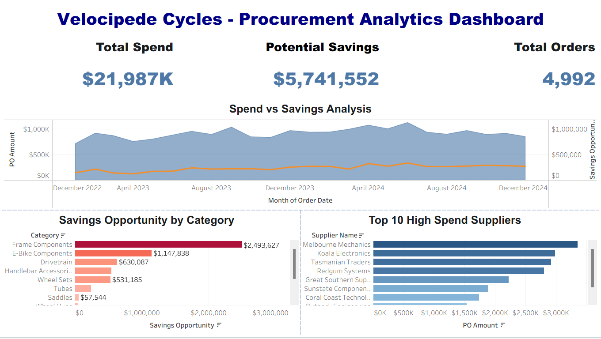

# 🚲 Velocipede Cycles - Procurement Analytics Dashboard

### 📊 Project Overview
This project analyzes 2 years of procurement data for 'Velocipede Cycles', an Australian retail chain. The goal was to identify shrinking profit margins and provide actionable insights on supplier performance and cost-saving opportunities.

**My Role:** End-to-End Data Analyst (Data Cleaning to Visualization)

---

### 🛠 Tech Stack Used
- **Python (Pandas):** For Data Quality Assessment, Cleaning & Merging multiple data sources.
- **Tableau:** For creating the interactive Dashboard and KPI analysis.
- **Excel:** Initial data exploration.

---

### 🔍 Key Insights Delivered
1.  **Identified Cost Leakage:** Highlighted "Frame Components" as the category with the highest potential savings gap ($2.4M).
2.  **Supplier Risk:** Flagged top spending suppliers to negotiate better contract terms.
3.  **Spend Trends:** Analyzed monthly spending patterns to correlate with profitability drops.

---

### 📉 Dashboard Preview

